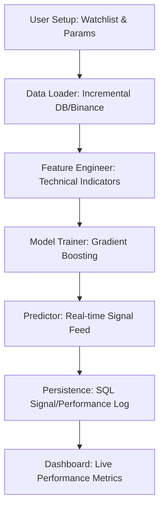

# ⚡ Green Surge Bolt: AI Trading Bot

Green Surge Bolt is a sophisticated, machine-learning-powered cryptocurrency trading bot designed for high-frequency analysis and signal generation. It features a stunning green-themed dashboard, persistent memory via MySQL, and multi-page analytics.

---

## Key Features

-   **Multi-Page UI**: Dedicated views for **Analysis** (Live Signal Generation) and **Performance** (Historical Audit & Metrics).
-   **Self-Healing MySQL Persistence**: Secure, server-side data storage for watchlists, signal history, and model performance.
-   **AI-Driven Signals**: Predicts market moves using Gradient Boosting algorithms with real-time confidence scores.
-   **Incremental Data Loading**: Efficient database-driven data fetching that minimizes API calls to Binance.
-   **Signature Aesthetic**: Fully themed "Green Surge Bolt" interface with optimized primary accents and sliders.

---

## System Overview

### 1. Analysis Page
- **Coin Discovery**: Auto-fetch trending coins from Binance (Top Volume 24h).
- **Custom Watchlist**: Persistent symbol selection across sessions.
- **AI Prediction**: Train and run models on specific pairs with configurable lookback and sensitivity.
- **Risk Management**: Integrated Position Sizing, Stop Loss, and Take Profit sliders.

---

## Trading Terminology

| Parameter | Definition | Purpose |
| :--- | :--- | :--- |
| **Training Days Lookback** | The historical window (in days) used to feed the AI model. | **Context**: 30 days looks at recent trends; 365 days looks at long-term patterns. |
| **Signal Sensitivity (%)** | The % price movement the AI must predict to trigger a signal. | **Aggression**: Lower % (e.g. 0.5%) triggers more trades; Higher % (e.g. 2.0%) is more conservative. |
| **Position Size (%)** | How much of your total wallet is allocated to a single trade. | **Risk Control**: Limits exposure so one bad trade doesn't wipe out your account. |
| **Stop Loss (%)** | The % drop at which the bot automatically exits to prevent further loss. | **Defense**: Your "Safety Net" that locks in a maximum acceptable loss. |
| **Take Profit (%)** | The % gain at which the bot automatically exits to secure winnings. | **Offense**: Ensures you walk away with profit before the market reverses. |

---

### 2. Performance Page
- **Global Model Performance**: Track Win Rate (%), Total Trades, and P/L ($) across all coins.
- **Signal History Audit**: Review the last 20 generated suggestions with precision pricing.
- **Stats Management**: One-click reset for performance metrics.

---

## Technical Architecture

### Machine Learning (Scikit-learn)
The bot uses a **Gradient Boosting Classifier** to identify 3-class market regimes:
- **BUY**: Expected future returns > +Sensitivity threshold.
- **HOLD**: Consolidated price action.
- **SELL**: Expected future returns < -Sensitivity threshold.

### Persistence (SQLAlchemy + MySQL)
The persistence layer is designed for reliability:
- **Automatic Fallback**: Gracefully uses local SQLite if MySQL is unreachable, but will **automatically upgrade** back to MySQL once it's restored.
- **Database Tables**:
  - `symbols`: Persistent watchlist storage.
  - `ohlcv`: Historical candlestick cache for lightning-fast reloading.
  - `settings`: Saves your risk parameters (Lookback, SL/TP).
  - `signal_logs`: Detailed audit trail of AI recommendations.
  - `performance_stats`: Granular trade-by-trade win/loss tracking.

---

## Configuration & Setup

### Environment Variables (.env)
Create a `.env` file in the root directory with your credentials:
```env
DB_HOST=127.0.0.1
DB_PORT=3306
DB_USER=root
DB_PASS=your_password
DB_NAME=trading_bot
```

### Installation
```bash
pip install -r requirements.txt
```

### Running the App
```bash
streamlit run app.py
```

---

## System Workflow



---

> [!WARNING]
> **Financial Risk**: Trading cryptocurrencies involves significant risk. This bot is for educational and simulation purposes only. Never trade money you cannot afford to lose.
